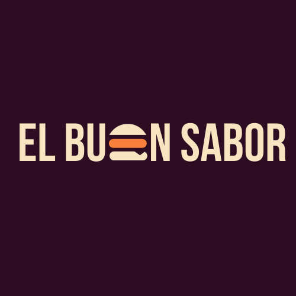

# DESARROLLO DE SOFTWARE 2023 - EL BUEN SABOR

 
    

         
     

# Datos Institucionales
 

     
 

* Año: 2023
* Comisión: 3K09
* Grupo: Empresaurios
* Profesor: Alberto Cortez
* Cátedra: Desarollo De Software
* Proyecto: Ecommerce de Comida Rápida El Buen Sabor
* Universidad Tecnológica Nacional - Facultad Regional Mendoza

# Carpeta del trabajo 

https://docs.google.com/document/d/1N-0oGx0TzvMB-i9eXE14xf1dZz9xBYo6/edit?rtpof=true

# Enlace a Jira

https://empresaurios.atlassian.net/jira/software/projects/EBS/boards/1/timeline

# Breve resumen del proyecto

El delivery de comidas de la ciudad “El Buen Sabor” ofrece a sus clientes una amplia variedad de bebidas y de comidas de fabricación propia. Posee un horario de atención de lunes a domingos de 20:00 a 12:00, y de sábados y domingos de 11:00 a 15:00. Los clientes tienen a disposición un menú que describe cada una de las comidas, el nombre, los ingredientes y el precio. Los clientes realizan sus pedidos en el mostrador del local mediante una PC o pueden hacerlo en forma remota desde su casa o su celular personal (la aplicación debe ser responsive).

# Temática del Sitio:

<h3>Se nos pide realizar una aplicación web ecommerce de comida rápida</h3>

* Delivery de Comida Rápida
* La aplicación debe ser RESPONSIVA
* Debe contar con todos los menús disponibles, con ingredientes,precios,y un nombre
* Se debe de poder realizar pedidos desde una PC en el local, en casa, o desde un celular
* El cliente debe poder registrarse en la aplicación
* El cliente debe poder realizar un pedido que debe contar con todos los datos necesarios para su identificación
* El pedido puede retirarse en local o ser enviado a domicilio
* Se reciben como medios de pago efectivo (en local) o Mercado Pago (en delivery)
* Se debe proporcionar el tiempo estimado de demora para entregar un pedido

# Se proporcionan las siguientes funciones principales: 

* Registro y administración de Clientes
* Adminstrar usuarios y Roles
* La clave del usuario debe estar encriptada
* Administración de Pedidos
* Administración de Facturas
* Administración de Articulos y artículos manufacturados
* Envio email al cliente de la factura
* Implementar pago: mediante varias formas de pago
* Control de Stock
* Administración del rubro

# Funcionalidades de estadísticas y información relevante:

* Ranking de comida mas pedidas en un periodo de tiempo
* Ingresos por periodos de tiempo. Diario/mensual
* Cantidad de pedidos agrupados por cliente en un determinado periodo de tiempo
* Monto de ganancia en un periodo (ventas - costos)

# Interfaces de usuario principales del sistema:

*	Portal WEB donde el cliente podrá registrarse y realizar los pedidos vía PC o celular
*	Interfaces de administración de pedidos y facturas por parte del empleado cajero
*	Interface de pedidos pendientes para el cocinero
*	Interface de administración de artículos y artículos manufacturados
*	Reportes estadísticos para toma de decisiones

# Módulos del sistema:

* Módulo de usuario
* Módulo de realización de pedidos
* Módulo de recepción y entrega de pedidos
* Módulo de Cocina
* Módulo de venta
* Módulo de rubros, stock de ingredientes y productos
* Módulo de Estadísticas e informes

# Público Objetivo:

* Adolescentes y jóvenes
* Consumidores de cómida rápida
* Consumidores de Hamburguesas, Bebidas
* Dueños de Franquicias de Comida Rápida
* Personas Interesadas en la Compra Venta de Comida rápida por internet

# Integrantes del Grupo:

* Jana Bacin
* Matias Mesa
* Dario Lopez
* Felipe Haudet
* Andrés Totera
* Agustín Zurano
* Jennifer Ledesma
* Valentina Ilardo

# TECNOLOGÍAS UTILIZADAS:

* 
* 
* 
* 
* 
* 
* 
* 
* 
* 
* 

