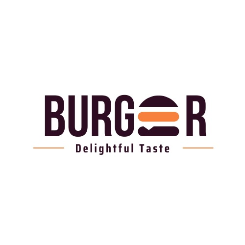

# DesarrolloDeSoftware-2023-ElBuenSabor

 
    

         
     

<h2 align="center">¡Bienvenidos a nuestro proyecto! El Buen Sabor</h2>

# Datos Institucionales
 

     
 

* Año: 2023
* Comisión: 3K09
* Grupo: Empresaurios
* Profesor: Alberto Cortez
* Cátedra: Desarollo De Software
* Proyecto: Ecommerce de Comida Rápida El Buen Sabor
* Universidad Tecnológica Nacional - Facultad Regional Mendoza

# Integrantes del Grupo
